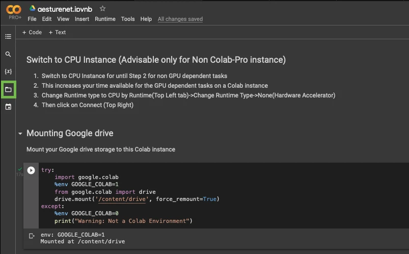
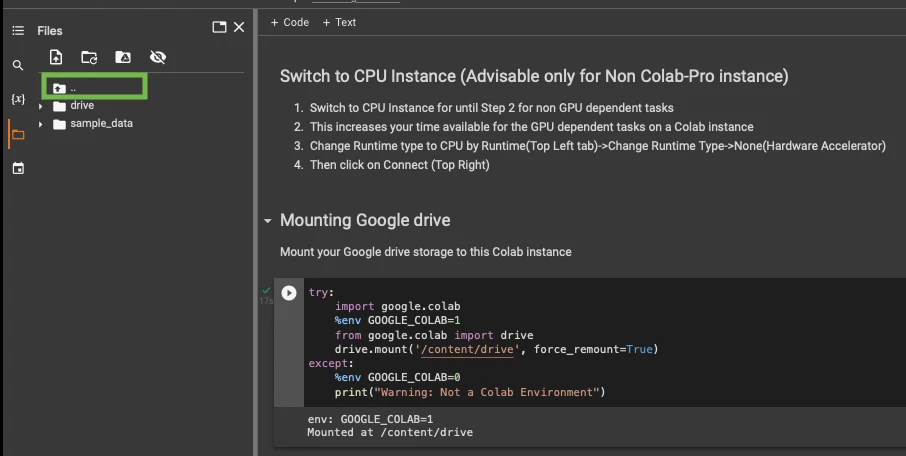
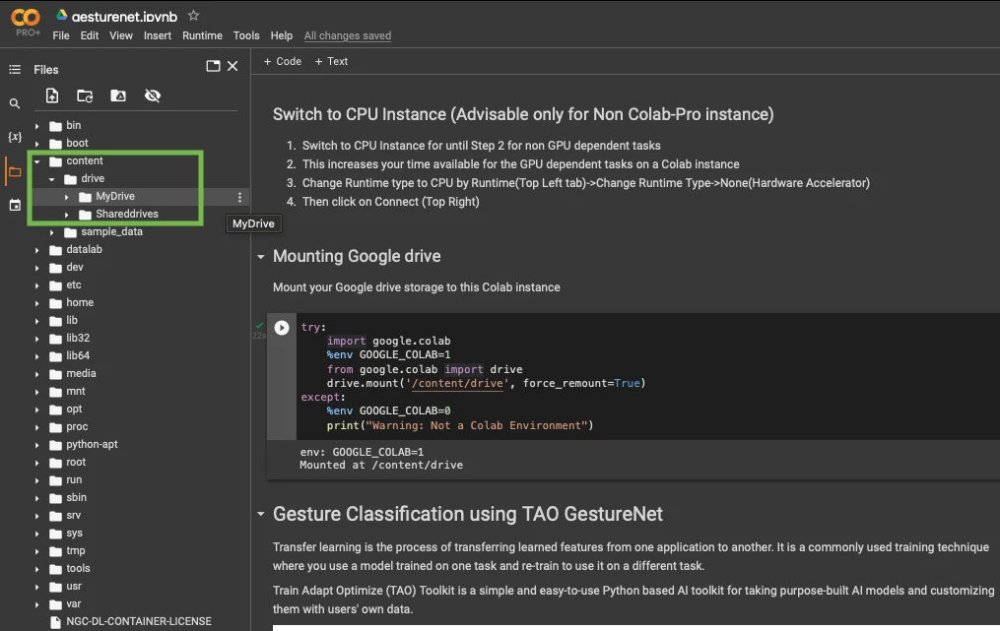

# Running TAO on Google Colab

Nvidia TAO can be used on Google Colab with some limitations. This page provides instructions for getting started with TAO on Google Colab.

Source: https://docs.nvidia.com/tao/tao-toolkit/text/running_in_cloud/running_tao_toolkit_on_google_colab.html

## Requirements

To use Google Colab, you’ll need a Google Account with Google Drive access.


## Table of Contents

TODO

## TAO Notebooks supported with Google Colab

TAO provides an extensive model zoo containing pretrained models for different computer-vision use cases.
<!-- Add link to the doc Steps to Locate files in a Colab Notebook -->
Refer to the Steps to Locate files in a Colab Notebook section for an example of accessing files within the Colab notebook.

Below we have tables with the following models:
- General-Purpose Computer Vision Models
- Purpose-Built Computer Vision Models

<!-- List of models -->

### General-Purpose Computer Vision Models

With general purpose models, you can train an image classification model, object detection model, or an instance segmentation model.

<!-- ############################################################### -->

|          **Model Name**          |                                                                               **One-Click Deploy**                                                                               |    **Action**    |
|:--------------------------------:|:--------------------------------------------------------------------------------------------------------------------------------------------------------------------------------:|:----------------:|
| Multi-class Image Classification |          [Multi-class Image Classification](https://colab.research.google.com/github/NVIDIA-AI-IOT/nvidia-tao/blob/main/tensorflow/classification/classification.ipynb)          |  Classification  |
|  Multi-task Image Classification | [Multi-tas Image Classification](https://colab.research.google.com/github/NVIDIA-AI-IOT/nvidia-tao/blob/main/tensorflow/multitask_classification/multitask_classification.ipynb) |  Classification  |
|               DSSD               |                 [Object Detection using Deformable DSSD](https://colab.research.google.com/github/NVIDIA-AI-IOT/nvidia-tao/blob/main/tensorflow/dssd/dssd.ipynb)                 | Object Detection |
|           EfficientDet           |           [Object Detection using EfficientDet](https://colab.research.google.com/github/NVIDIA-AI-IOT/nvidia-tao/blob/main/tensorflow/efficientdet/efficientdet.ipynb)          | Object Detection |
|             RetinaNet            |               [Object Detection using RetinaNet](https://colab.research.google.com/github/NVIDIA-AI-IOT/nvidia-tao/blob/main/tensorflow/retinanet/retinanet.ipynb)               | Object Detection |
|                SSD               |                        [Object Detection using SSD](https://colab.research.google.com/github/NVIDIA-AI-IOT/nvidia-tao/blob/main/tensorflow/ssd/ssd.ipynb)                        | Object Detection |
|              Yolo V3             |                  [Object Detection using Yolo V3](https://colab.research.google.com/github/NVIDIA-AI-IOT/nvidia-tao/blob/main/tensorflow/yolo_v3/yolo_v3.ipynb)                  | Object Detection |
|              Yolo V4             |                  [Object Detection using Yolo V4](https://colab.research.google.com/github/NVIDIA-AI-IOT/nvidia-tao/blob/main/tensorflow/yolo_v4/yolo_v4.ipynb)                  | Object Detection |
|           Yolo V4 Tiny           |           [Object Detection using Yolo V4 Tiny](https://colab.research.google.com/github/NVIDIA-AI-IOT/nvidia-tao/blob/main/tensorflow/yolo_v4_tiny/yolo_v4_tiny.ipynb)          | Object Detection |

<!-- ############################################################### -->

### Purpose-Built Computer Vision Models

Purpose-built models are built for high accuracy and performance. You can deploy these models out of the box for applications such as smart city, retail, public safety, and healthcare. You can also retrain them with your own data.

<!-- ############################################################### -->
|     **Model Name**    |                                                                  **One-Click Deploy**                                                                 |                  **Purpose**                  |
|:---------------------:|:-----------------------------------------------------------------------------------------------------------------------------------------------------:|:---------------------------------------------:|
|  ActionRecognitionNet |   [Action Recognition](https://github.com/NVIDIA-AI-IOT/nvidia-tao/blob/main/pytorch/cv_notebooks/action_recognition_net/actionrecognitionnet.ipynb)  |         Detecting actions from videos         |
|         LPRNET        |        [License Plate Recognition](https://colab.research.google.com/github/NVIDIA-AI-IOT/nvidia-tao/blob/main/tensorflow/lprnet/lprnet.ipynb)        |        Recognize License plates numbers       |
| PoseClassificationNet | [Pose Classification](https://github.com/NVIDIA-AI-IOT/nvidia-tao/blob/main/pytorch/cv_notebooks/pose_classification_net/poseclassificationnet.ipynb) | Classify poses of people from their skeletons |
<!-- ############################################################### -->

### TAO Pre-trained Models (Inference Only)

In addition to training different models using the one-click deploy links, you can run inference with the Pre-trained Models TAO has published using this Notebook: 

- [TAO PTM Inference using TAO-Deploy](https://colab.research.google.com/github/NVIDIA-AI-IOT/nvidia-tao/blob/main/tao_deploy/tao_deploy.ipynb)

<!-- ############################################################### -->

## Utility Scripts to obtain subset of data

If you have limited storage space, or want to iterate quickly through training experiments, we suggest you

- Download data on to your local system
- Run a utility script to generate a subset of the dataset
- Upload this smaller dataset to your Google Drive to run experiments on


TAO provides utility scripts to generate such subsets for COCO dataset (which is around ~25 GB with ~120k images) and KITTI dataset (which is around ~12 GB with ~14k images)

<!-- ############################################################### -->
### Obtain Data subset for KITTI

- The subset generation file is present [here](https://github.com/NVIDIA-AI-IOT/nvidia-tao/blob/main/tensorflow/utils/generate_kitti_subset.py). Run this script in your local system (not in Colab as you might have storage limitations)

- Download and unzip kitti training and testing zip files [here](https://www.cvlibs.net/datasets/kitti/eval_object.php?obj_benchmark=2d), you’ll have 2 folders training and testing
<!-- ############################################################### -->
- To obtain subset for training:

> ```bash
> python generate_kitti_subset.py --source-data-dir=path_to_training_folder --out-data-dir=path_to_save_subset_data/training/ --training True --num-images=num_of_images_in_subset
> ```

Example

> ```bash
> python generate_kitti_subset.py --source-data-dir=/home/user/data/training --out-data-dir=/home/user/subset_data/training/  --training True --num-images=100
> ```

<!-- ############################################################### -->
- To obtain subset for testing:

> ```bash
> python generate_kitti_subset.py --source-data-dir=path_to_training_folder --out-data-dir=path_to_save_subset_data/training/ --num-images=num_of_images_in_subset
> ```

Example
> ```bash
> python generate_kitti_subset.py --source-data-dir=/home/user/data/testing --out-data-dir=/home/user/subset_data/testing/ --num-images=100
> ```

<!-- ############################################################### -->
Dataset folder structure for kitti:
```
path_to_training_folder
|___images
|___labels

path_to_testing_folder
|___images
```

<!-- ############################################################### -->
### Obtain Data subset for COCO

- The subset generation file is present [here](https://github.com/NVIDIA-AI-IOT/nvidia-tao/blob/main/tensorflow/utils/generate_coco_subset.py). Run this script in your local system (not in Colab as you might have storage limitations)

- Download and unzip 2017 train and val images, 2017 train/val annotations from [here](https://cocodataset.org/#download).

<!-- ############################################################### -->
- To obtain subset for training:

> ```bash
> python generate_coco_subset.py --source-image-dir=path_to_train2017_folder --source-annotation-file=path_to_instances_train2017.json_file --out-data-dir=path_to_save_subset_data --num-images=num_of_images_in_subset
> ```

Example:

> ```bash
> python generate_coco_subset.py --source-image-dir=/home/user/data/train2017 --source-annotation-file=/home/user/data/annotations/instances_train2017.json --out-data-dir=/home/user/subset_data/ --num-images=100
> ```
<!-- ############################################################### -->
- To obtain subset for validation:

> ```bash
> python generate_coco_subset.py --source-image-dir=path_to_val2017_folder --source-annotation-file=path_to_instances_val2017.json_file --out-data-dir=path_to_save_subset_data --num-images=num_of_images_in_subset
> ```

Example:

> ```bash
> python generate_coco_subset.py --source-image-dir=/home/user/data/val2017 --source-annotation-file=/home/user/data/annotations/instances_val2017.json --out-data-dir=/home/user/subset_data/ --num-images=100
> ```
<!-- ############################################################### -->
Dataset folder structure for coco:

```
folder_into_which_downloaded_coco_files_are_unzipped
|___train2017
|___val2017
|___annotations
    |___instances_train2017.json
    |___instances_val2017.json
```

<!-- ############################################################### -->

## Steps to Locate Files in a Colab Notebook

1. Mount the drive in the Colab Instance.
1. Click on the folder icon (shown within the green box)
<!-- add image1 -->


1. Click on the ‘move up one folder’ icon (shown within the green box)
<!-- add image2 -->


- Now you can view all folders that are tied to this instance.
- The google drive you mounted is present at <mark style="background-color: #f0ffab; opacity: 0.80;">**content->drive->MyDrive**</mark>. <!-- #f0ffab #ffffff -->
- All the folders listed in the below screenshot are folders in the root directory “/”.

<!-- add image3 -->


<!-- ############################################################### -->
## Notes

<!-- ############################################################### -->
- The following TAO networks can’t run on Colab until Colab has updated its drivers to 515 or above: 

> Detectnetv2, BPNET, FasterRCNN, FPNet, and Gazenet.
<!-- ############################################################### -->
- Any folder that is not in <mark style="background-color: #f0ffab; opacity: 0.80;">**/content/drive/MyDrive/**</mark> will be a volatile path: You’ll lose access to the contents when the session disconnects
<!-- ############################################################### -->
- If you have a 15GB drive storage limit, try setting the data folder to <mark style="background-color: #f0ffab; opacity: 0.80;">**/content/data/data_you_are_downloading**</mark> instead of using the drive at **/content/drive/MyDrive**</mark>.
    - This is preferred because volatile storage is greater than 15G.B
    - You can also upload a file downloaded on your system to <mark style="background-color: #f0ffab; opacity: 0.80;">**/content/data**</mark> using the drag-and-drop method.
<!-- ############################################################### -->
- The browser tab needs to be active for the duration of a Colab session. To keep the Colab instance active in the background, you can use a third party extension like [Colab Alive](https://chromewebstore.google.com/detail/colab-alive/eookkckfbbgnhdgcbfbicoahejkdoele?hl=en-GB&pli=1).
<!-- ############################################################### -->
- In Tensorflow notebooks, to maximize GPU usage, you can switch to GPU hardware only after completing the data download and preprocessing steps that doesn’t require a GPU:
    - At the point of switching to a GPU instance, it is fine to terminate the previous instance.
    - You can keep running successive cells without rerruning any of the previous cells, with the following exceptions:
        - If some data was saved in the volatile storage instead of the Google Drive storage, then switching instances will delete the data.
        - In such cases, the data must be backed up to Google Drive before terminating. This can be achieved with a simple Linux copy command:
        > ```bash 
        > cp path_to_volatile_storage /content/drive/MyDrive/folder_to_be_copied_into
        > ```
<!-- ############################################################### -->
<!-- This needs to update -->
- With the free version of Colab, GPU instances can run a maximum of 8 hours.
<!-- ############################################################### -->
<!-- This needs to update -->
- With the free version of Colab, only one GPU instance notebook can run at a time.
    - Colab Pro can run two GPU instance notebooks simultaneously.
<!-- ############################################################### -->
<!-- This needs to update -->
- Colab does not allow you to choose the GPU type.
    - As of November 2022, the predominant GPU is a Tesla T4 with the free version and a P100 with Colab Pro.
<!-- ############################################################### -->